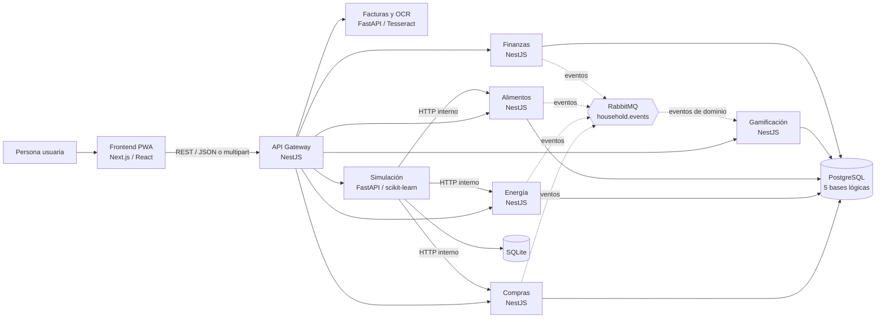
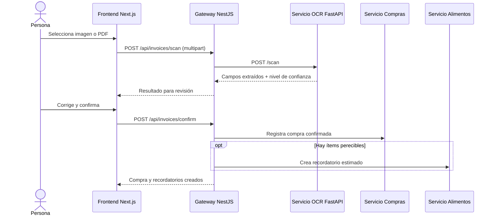

# Informe de metodología, arquitectura y frameworks

## 1. Propósito y alcance

Este documento explica cómo está construido Gemelo Digital de Consumo del Hogar y cómo se aplican sus principales decisiones técnicas. Describe el código presente en este checkout: la aplicación web, el gateway, los servicios de dominio, persistencia, mensajería, simulación y lectura de facturas. No describe componentes futuros como si ya estuvieran implementados.

El sistema tiene un propósito educativo relacionado con el ODS 12: registrar y relacionar compras, energía, desperdicio de alimentos, finanzas y hábitos sostenibles. Las tarifas y los factores de carbono que aparecen en el proyecto son referenciales; no reemplazan datos oficiales ni una factura real.

## 2. Resumen ejecutivo

El proyecto utiliza una arquitectura de microservicios organizada por capacidades del dominio. Una aplicación web Next.js consume una API de entrada implementada con NestJS. El gateway enruta las operaciones a servicios NestJS o FastAPI; los servicios colaboran por HTTP cuando una respuesta inmediata es necesaria y publican eventos en RabbitMQ para reacciones desacopladas, como asignar puntos.

PostgreSQL se despliega como una instancia compartida en Docker Compose, con cinco bases lógicas para los servicios NestJS: compras, energía, alimentos, gamificación y finanzas. El servicio de simulación utiliza SQLite. El servicio de facturas procesa imágenes y PDF con una estrategia OCR que prioriza la revisión humana antes de confirmar una compra.



Referencias de implementación: [docker-compose.yml](../docker-compose.yml), [gateway/src/proxy.controller.ts](../gateway/src/proxy.controller.ts), [gateway/src/dashboard.controller.ts](../gateway/src/dashboard.controller.ts) y [infra/postgres/init.sql](../infra/postgres/init.sql).

## 3. Metodología aplicada

### 3.1 Separación por capacidades del dominio

Las responsabilidades se distribuyen por áreas que tienen datos y reglas diferentes:

| Capacidad | Servicio | Qué resuelve |
| --- | --- | --- |
| Compras | `purchases-svc` | Registro, consulta y resumen de compras. |
| Energía | `energy-svc` | Lecturas, facturas de electricidad, tarifa y CO₂ asociado. |
| Alimentos | `food-svc` | Inventario de alimentos, estados y recordatorios de vencimiento. |
| Gamificación | `gamification-svc` | Puntos, niveles, logros e historial. |
| Finanzas | `finances-svc` | Cuentas, transacciones, presupuestos y metas. |
| Facturas | `invoices-svc` | Extracción OCR de campos de una factura cargada. |
| Simulación | `simulation-svc` | Proyecciones, anomalías y comparación de escenarios. |

Por ejemplo, finanzas es un servicio propio porque las invariantes de cuentas y transacciones no son las mismas que las de compras. En [account.entity.ts](../services/finances/src/entities/account.entity.ts), la cuenta protege su saldo: un egreso no puede ser mayor que el balance disponible. En [finances.service.ts](../services/finances/src/finances.service.ts), las transacciones actualizan el balance dentro de una transacción de base de datos.

Es una arquitectura orientada al dominio e inspirada en DDD, pero no una implementación estricta de DDD o de arquitectura hexagonal en todos los servicios. Los límites por capacidad sí están reflejados en los procesos, módulos, contratos y datos.

### 3.2 Separación por capas dentro de los servicios

En los servicios NestJS se distinguen principalmente:

- **Controladores:** adaptan HTTP a una llamada de aplicación. Por ejemplo, [energy.controller.ts](../services/energy/src/energy.controller.ts) valida la ruta y delega las operaciones a `EnergyService`.
- **Servicios de aplicación:** coordinan validación, repositorios, reglas y eventos. [energy.service.ts](../services/energy/src/energy.service.ts) guarda la lectura y solicita la publicación del evento correspondiente.
- **Entidades, políticas y value objects:** concentran reglas reutilizables. [electricity-tariff.vo.ts](../services/energy/src/electricity-tariff.vo.ts) calcula los tramos de tarifa; [points-policy.ts](../services/gamification/src/domain/points-policy.ts) concentra los puntos y motivos por evento.
- **Adaptadores de infraestructura:** conectan la aplicación con TypeORM, RabbitMQ, HTTP y almacenamiento. [event-consumer.service.ts](../services/gamification/src/event-consumer.service.ts) recibe mensajes y delega la decisión de puntos a la política de dominio.

La intención es que las reglas, como “un egreso no deja una cuenta en negativo” o “una lectura eficiente recibe cierta puntuación”, no queden duplicadas en la interfaz ni mezcladas con detalles de transporte.

### 3.3 Comunicación síncrona y asíncrona

La comunicación usa dos mecanismos con propósitos distintos:

1. **HTTP/REST síncrono:** se usa cuando la pantalla necesita una respuesta para continuar. El frontend llama al gateway; el gateway reenvía la operación al servicio correspondiente. El endpoint `/api/dashboard` agrega varios resúmenes y usa `Promise.allSettled` para devolver las secciones disponibles aunque uno de los servicios falle.
2. **RabbitMQ asíncrono:** se usa para eventos que otros servicios pueden procesar después. Por ejemplo, compras publica `purchase.registered` y gamificación lo consume para asignar puntos. El exchange `household.events` está configurado como `topic`; véanse [infra/rabbitmq/definitions.json](../infra/rabbitmq/definitions.json) y [event-consumer.service.ts](../services/gamification/src/event-consumer.service.ts).

Así, el servicio que registra una compra no necesita conocer la implementación interna del sistema de puntos. RabbitMQ está integrado en varios servicios; no significa que cada llamada de la aplicación pase por una cola.

### 3.4 Validar antes de persistir y hacer visibles las incertidumbres

Los endpoints validan entradas en la capa de servicio antes de escribir datos. Ejemplos: lectura de energía positiva, mes en formato `YYYY-MM`, montos positivos y categorías permitidas. Cuando una regla falla, el servicio devuelve un error HTTP de cliente en lugar de guardar un registro inválido.

En OCR, la metodología es deliberadamente conservadora: se extraen candidatos, se revisan campos y montos, y la UI presenta los resultados para corregirlos antes de confirmar. La extracción no equivale a una verificación fiscal ni debería guardarse automáticamente como si fuera infalible.

## 4. Arquitectura: qué habla con qué

### 4.1 Frontend y API Gateway

El frontend es una aplicación web Next.js con rutas del App Router bajo `frontend/src/app`. El componente raíz [AppShell.tsx](../frontend/src/components/AppShell.tsx) organiza la experiencia y registra el service worker. La aplicación declara un manifiesto PWA en `frontend/public/manifest.json` y el script de caché en `frontend/public/sw.js`.

La capa [api.ts](../frontend/src/lib/api.ts) centraliza las llamadas HTTP. Si no hay una URL de API válida o se fuerza `NEXT_PUBLIC_DEMO_MODE`, cambia al adaptador local de [demo.ts](../frontend/src/lib/demo.ts), que utiliza el fixture `frontend/public/demo-data.json` y almacenamiento del navegador. Esto permite mostrar la interfaz sin desplegar los servicios.

El gateway NestJS es la entrada HTTP para el frontend. [proxy.controller.ts](../gateway/src/proxy.controller.ts) reenvía rutas hacia las URLs internas de cada servicio y traduce errores de servicios remotos a respuestas HTTP. [dashboard.controller.ts](../gateway/src/dashboard.controller.ts) compone datos de compras, energía, alimentos, finanzas y gamificación para el panel.

### 4.2 Servicios de dominio

Los contenedores se comunican por nombres de servicio de Docker Compose, por ejemplo `purchases-svc:3001` o `invoices-svc:3005`. El gateway recibe las rutas públicas `/api/...` y adapta sus contratos a las rutas internas.

La configuración está en [docker-compose.yml](../docker-compose.yml). Además de los servicios de aplicación, define PostgreSQL, RabbitMQ y el frontend. PostgreSQL tiene una única instancia en Compose, pero [init.sql](../infra/postgres/init.sql) crea cinco bases lógicas: `purchases_db`, `energy_db`, `food_db`, `gamification_db` y `finances_db`. Por tanto, hay separación lógica de datos, no una instancia de base de datos independiente por microservicio.

La excepción de persistencia es Simulación: [database.py](../services/simulation/app/database.py) configura SQLite en `simulation.db`. Compose no define un volumen específico para ese archivo, así que su persistencia depende del ciclo de vida del contenedor.

### 4.3 Recorrido de una factura



El recorrido está implementado por [escanear/page.tsx](../frontend/src/app/escanear/page.tsx), [api.ts](../frontend/src/lib/api.ts), [proxy.controller.ts](../gateway/src/proxy.controller.ts) y [main.py](../services/invoices/main.py). El formulario permite corregir tienda, fecha, total, NIT, número, categoría e ítems antes de llamar a confirmar.

## 5. Frameworks y tecnologías

| Tecnología | Versión declarada | Dónde se aplica | Motivo dentro del proyecto |
| --- | --- | --- | --- |
| Next.js | `14.1.0` | `frontend/` | Enrutamiento y renderizado de la aplicación React; estructura de páginas bajo App Router. |
| React | `18.2.0` | `frontend/` | Componentes y estado de la interfaz, incluido el flujo de captura, procesamiento y revisión de facturas. |
| TypeScript | `^5.3.3` | Frontend, gateway y servicios NestJS | Tipado estático para componentes, contratos y clases de servidor. |
| Tailwind CSS | `^3.4.0` | `frontend/` | Estilos utilitarios y variantes claro/oscuro en la interfaz. |
| NestJS | `^10.3.0` | Gateway y servicios de dominio Node | Módulos, controladores, inyección de dependencias y servicios HTTP estructurados. |
| TypeORM | `^0.3.20` | Servicios NestJS con persistencia | Mapeo de entidades a PostgreSQL; por ejemplo, lecturas, facturas de energía y cuentas. |
| FastAPI | Simulación: `0.109.0`; facturas: sin versión fijada | `services/simulation/`, `services/invoices/` | Endpoints Python para simulación y recepción de archivos OCR. |
| scikit-learn | `1.4.0` | `services/simulation/` | Regresión lineal para proyectar series históricas. |
| Tesseract + pytesseract | Tesseract se instala en Docker; paquete Python sin pin | `services/invoices/` | OCR en español para imágenes y páginas escaneadas de PDF. |
| PyMuPDF | `pymupdf` sin versión fijada en requirements | `services/invoices/` | Extracción de texto de PDF digital y rasterización de páginas escaneadas. |
| PostgreSQL | Imagen `16-alpine` | Compras, energía, alimentos, gamificación y finanzas | Persistencia relacional con bases lógicas separadas por servicio. |
| RabbitMQ | Imagen `rabbitmq:3-management-alpine` | Eventos entre servicios | Desacopla reacciones posteriores, como gamificación ante una compra. |
| Docker Compose | Especificación Compose | Raíz del proyecto | Construye, conecta y ejecuta el stack local con una red y variables de entorno compartidas. |

Las versiones de frontend están en [frontend/package.json](../frontend/package.json); las de NestJS, en [gateway/package.json](../gateway/package.json) y [services/purchases/package.json](../services/purchases/package.json); las de Python, en [services/simulation/requirements.txt](../services/simulation/requirements.txt) y [services/invoices/requirements.txt](../services/invoices/requirements.txt). Algunas dependencias Python del OCR no están fijadas a una versión exacta.

## 6. Cómo se aplican las áreas principales

### 6.1 Compras, energía y finanzas

- **Compras:** las compras confirmadas desde una factura se envían como una compra con categoría, descripción y monto. El servicio de compras conserva su propio contrato y publica un evento para consumidores interesados.
- **Energía:** [ElectricityTariff](../services/energy/src/electricity-tariff.vo.ts) calcula cargos por tramos, cargo fijo, alumbrado y CO₂. [EnergyService](../services/energy/src/energy.service.ts) valida la lectura, aplica el factor de carbono, persiste y publica eventos.
- **Finanzas:** las entidades representan cuentas, transacciones, metas y presupuestos. El agregado `Account` protege el saldo; `FinancesService` coordina la transacción en base de datos para guardar el movimiento y actualizar la cuenta.

Los parámetros de electricidad y carbono están declarados como referenciales en el código. No deben presentarse como tarifas oficiales ni como una medición científica certificada.

### 6.2 Gamificación y eventos

La puntuación vive en [points-policy.ts](../services/gamification/src/domain/points-policy.ts), no en la UI. El consumidor de RabbitMQ transforma routing keys como `purchase.registered`, `bill.saved`, `energy.reading`, `food.consumed` y `food.wasted` en decisiones de dominio. Por ejemplo, una compra otorga cinco puntos; una lectura inferior al umbral de 5 kWh recibe una puntuación distinta a una lectura normal.

### 6.3 Simulación y predicción

El servicio de simulación expone rutas FastAPI en [main.py](../services/simulation/app/main.py). `SimulationEngine` obtiene resúmenes de compras, energía y alimentos mediante HTTP interno y mantiene una capa de extracción de datos (`DataFetcher`) separada del cálculo.

En [simulation.py](../services/simulation/app/simulation.py), la proyección usa `LinearRegression` de scikit-learn, extiende la serie según el horizonte y calcula bandas con la desviación de los residuos. Menos de ocho observaciones se marca como preliminar. La detección de anomalías compara el último valor con la media histórica y usa un umbral del 30 %. Los escenarios modifican porcentajes de energía, desperdicio y compras para estimar diferencias económicas y de CO₂ mediante factores centralizados en [carbon_factors.py](../services/simulation/app/domain/carbon_factors.py).

Esto es una proyección estadística explicable y sencilla, no un modelo entrenado con aprendizaje continuo ni una garantía de ahorro futuro.

### 6.4 OCR de facturas

El endpoint de carga está en [services/invoices/main.py](../services/invoices/main.py) y el pipeline en [ocr.py](../services/invoices/ocr.py):

1. Identifica si el archivo es PDF o imagen.
2. Para un PDF con texto digital, extrae el texto con PyMuPDF; para un PDF escaneado, rasteriza la página y la envía al OCR.
3. Para imágenes, aplica escala de grises, contraste y umbral antes de consultar Tesseract con idioma español.
4. Conserva palabras y posiciones para agruparlas por líneas y buscar importes próximos a etiquetas concretas.
5. Normaliza separadores decimales y de miles; contempla el caso de factura que desglosa Gift Card y base de crédito fiscal.
6. Devuelve los campos para confirmación; el usuario puede corregirlos y la API valida el total antes de registrar la compra.

La categorización automática es heurística basada en palabras reconocidas, con `hogar` como fallback; permanece editable en la pantalla de revisión. No se decodifica el QR como parte de este flujo. Las pruebas en [test_ocr.py](../services/invoices/test_ocr.py) cubren payload vacío, OCR tolerante, suma de componentes, separadores numéricos y un PDF digital de texto.

OCR puede equivocarse ante fotos borrosas, reflejos, inclinación, impresiones pequeñas o diseños no vistos. Por eso la confirmación humana es parte del método, no un error del flujo.

## 7. Despliegue, configuración y límites observables

- `docker-compose.yml` es el entorno local integrado. Los nombres de servicio funcionan como hostnames dentro de la red Compose.
- El frontend se construye con `NEXT_PUBLIC_API_URL`; Next.js incorpora variables `NEXT_PUBLIC_*` durante el build, por lo que cambiar la URL requiere volver a construir la imagen.
- Vercel puede alojar el frontend, pero los servicios definidos en Docker Compose no se vuelven públicos por eso. El frontend desplegado necesita un gateway accesible públicamente o debe usar modo demo.
- La configuración TypeORM del servicio de energía usa `synchronize: true`; es conveniente para desarrollo/prototipo. Para producción se deben gestionar cambios de esquema mediante migraciones y revisar la configuración de datos.
- La base SQLite del servicio de simulación no tiene un volumen declarado en Compose. Si se necesita conservar su historial tras recrear el contenedor, debe configurarse persistencia explícita.
- Las dependencias de `services/invoices/requirements.txt` no fijan versiones exactas. Para reproducibilidad de despliegues conviene fijarlas y validar actualizaciones.
- Las tarifas y factores ambientales son simplificaciones de demostración; sus fuentes y vigencia deben confirmarse antes de usarlos para decisiones oficiales.

## 8. Verificación y forma de explicar el sistema

Comprobaciones disponibles en el repositorio:

```bash
# Levantar el stack local
docker compose up --build -d

# Generar datos de demostración
node scripts/seed.js

# Ejecutar las pruebas OCR
cd services/invoices
python -m unittest -q
```

Una explicación breve y fiel del sistema sería:

> “La interfaz Next.js envía las operaciones al gateway NestJS. Este las dirige a microservicios por área de negocio. Los servicios guardan sus datos y usan HTTP para respuestas inmediatas o RabbitMQ para notificar eventos. La aplicación calcula tarifas y escenarios con reglas explícitas; el servicio de simulación usa regresión lineal sobre históricos. El lector de facturas extrae candidatos con OCR, soporta imágenes y PDF, y siempre deja al usuario revisar antes de confirmar.”

## 9. Archivos clave para una presentación

| Tema que se explica | Archivo para mostrar |
| --- | --- |
| Topología y ejecución local | [docker-compose.yml](../docker-compose.yml) |
| Entrada y enrutamiento API | [proxy.controller.ts](../gateway/src/proxy.controller.ts) |
| Composición del dashboard | [dashboard.controller.ts](../gateway/src/dashboard.controller.ts) |
| Adaptador API y modo demo | [api.ts](../frontend/src/lib/api.ts) |
| Protección de balance financiero | [account.entity.ts](../services/finances/src/entities/account.entity.ts) |
| Tarifa de energía | [electricity-tariff.vo.ts](../services/energy/src/electricity-tariff.vo.ts) |
| Eventos y política de puntos | [event-consumer.service.ts](../services/gamification/src/event-consumer.service.ts), [points-policy.ts](../services/gamification/src/domain/points-policy.ts) |
| Predicción y escenarios | [simulation.py](../services/simulation/app/simulation.py) |
| OCR y revisión de factura | [ocr.py](../services/invoices/ocr.py), [escanear/page.tsx](../frontend/src/app/escanear/page.tsx) |